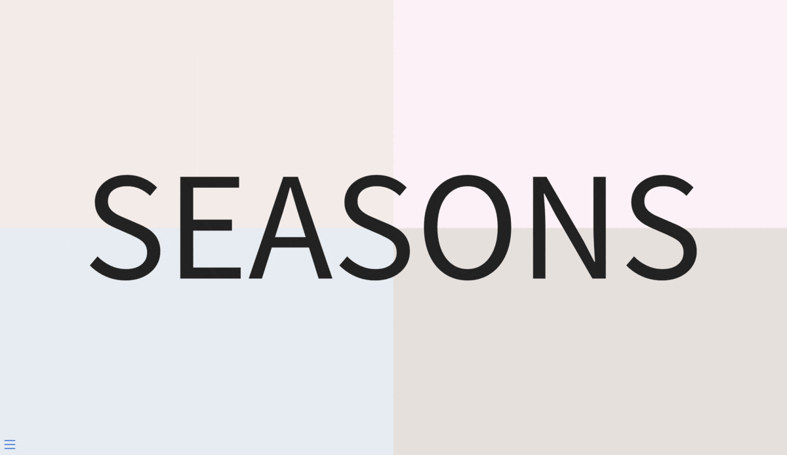

# quarto-revealjs-seasons

<!-- badges: start -->
<!-- badges: end -->

The goal of quarto-revealjs-seasons is an example of how to create a revealjs theme with multiple styles

[](https://emilhvitfeldt.github.io/quarto-revealjs-seasons/)

## Installation

To start a new presentation:

``` bash
quarto use template EmilHvitfeldt/quarto-revealjs-seasons
```

## Build the presentation

``` bash
quarto render mydocument.qmd
```

## Going further

Read the [Quarto documentation on reveal.js format](https://quarto.org/docs/presentations/revealjs/)
